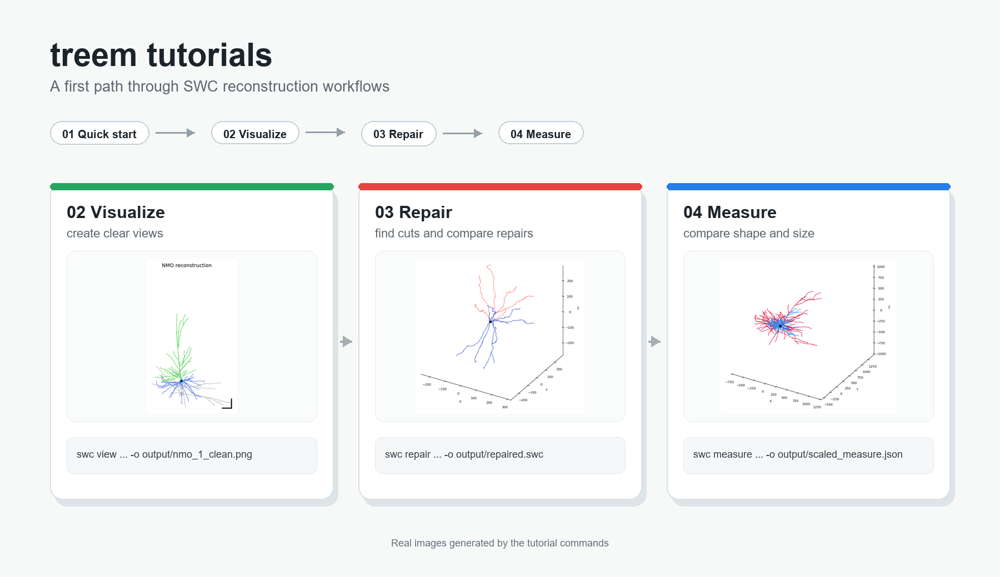

# Tutorials

Start with `01_quick_start.ipynb`, then use the focused tutorials to look more closely at each part of the workflow.

| Tutorial | Focus |
| --- | --- |
| `01_quick_start.ipynb` | Run a first complete workflow |
| `02_visualize_reconstructions.ipynb` | Create clear reconstruction views |
| `03_repair_reconstruction.ipynb` | Find cut points and repair a reconstruction |
| `04_measure_and_compare.ipynb` | Measure files and compare results |

The notebooks use terminal commands through small code cells and write temporary files to `data/` and `output/`.
